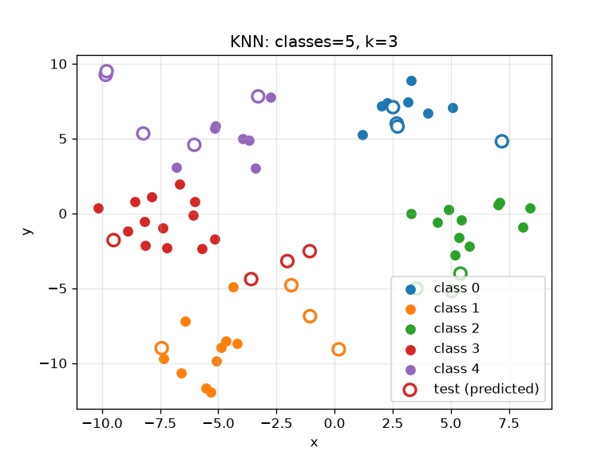

#+title: Lab1 Task
#+author: koftamainee

* Задание
Написать алогоритм KNN на Python
1. Количество классов случайно, от 2 до 5
2. Количество соседей случайно от 3 до 7
3. 50 точек генерируется случайно по задаваемому правилу
4. 20 точек тестовой выборки, полностью случайно
5. Классифицировать, построить график через matplotlib

* Подготовка окружения
Ставим зависимости (matplotlib, numpy) в виртуальное окружение .venv, системные пакеты не используем.

#+begin_src bash :results output
python3 -m venv .venv
.venv/bin/pip install --quiet matplotlib numpy
.venv/bin/python -c "import matplotlib, numpy; print('deps ok')"
#+end_src

#+RESULTS:
: deps ok

* Решение

#+begin_src python :results output :hlines
import random
import time
import numpy as np
from collections import Counter
import matplotlib
matplotlib.use('Agg')
import matplotlib.pyplot as plt

random.seed(int(time.time()))
np.random.seed(int(time.time()))

n_classes = random.randint(2, 5)
k = random.randint(3, 7)
n_train = 50
n_test = 20

centroids = [np.array([random.uniform(-10, 10), random.uniform(-10, 10)])
             for _ in range(n_classes)]

train_x, train_y = [], []
for _ in range(n_train):
    c = random.randrange(n_classes)
    cx = centroids[c] + np.random.normal(0, 1.5, 2)
    train_x.append(cx)
    train_y.append(c)

test_x = [np.array([random.uniform(-10, 10), random.uniform(-10, 10)])
          for _ in range(n_test)]

def knn(point, k):
    dists = np.linalg.norm(np.array(train_x) - point, axis=1)
    idx = np.argsort(dists)[:k]
    return Counter(train_y[i] for i in idx).most_common(1)[0][0]

pred = [knn(p, k) for p in test_x]
print(pred)

cmap = plt.cm.tab10.colors
for c in range(n_classes):
    pts = [x for x, y in zip(train_x, train_y) if y == c]
    plt.scatter([p[0] for p in pts], [p[1] for p in pts],
                color=cmap[c], marker='o', s=45, label=f'class {c}')
plt.scatter([p[0] for p in test_x], [p[1] for p in test_x],
            color='white', edgecolors=[cmap[c] for c in pred],
            linewidths=2, s=80, label='test (predicted)')
plt.xlabel('x')
plt.ylabel('y')
plt.title(f'KNN: classes={n_classes}, k={k}')
plt.legend()
plt.grid(alpha=0.3)
plt.savefig('lab1_knn.png', dpi=120)
#+end_src

#+RESULTS:
: [0, 0, 1, 1, 0, 1, 0, 0, 1, 1, 0, 0, 1, 1, 0, 0, 0, 0, 0, 1]

